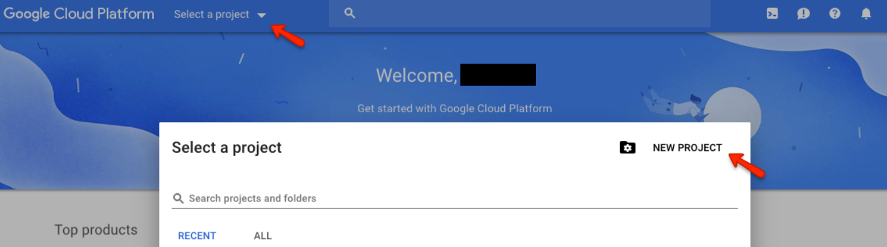
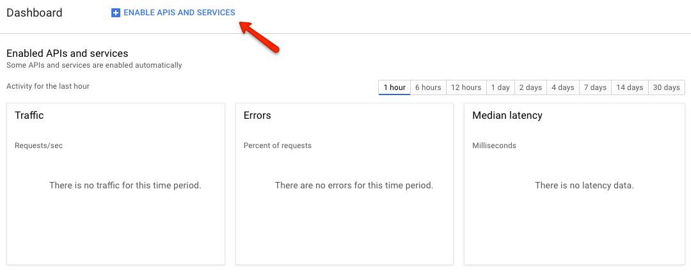
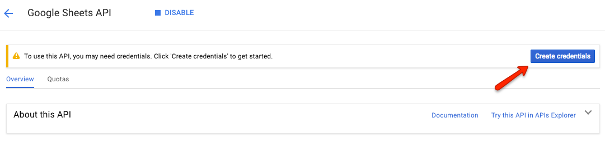
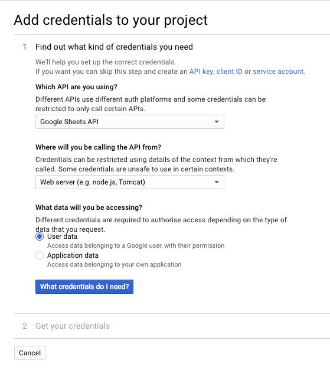

In order to start using babelsheet, you have to configure your `.env.babelsheet` file first. If you want, you can keep envs in `.env` file, all variables stored in `.env` will be overwritten by those stored in `.env.babelsheet`.

## Configuration file

```
CLIENT_ID=<GOOGLE-CLIENT-ID>
CLIENT_SECRET=<GOOGLE-CLIENT-SECRET>
SPREADSHEET_ID=<SPREADSHEET-ID>
SPREADSHEET_NAME=<SPREADSHEET-NAME>
REFRESH_TOKEN=<REFRESH-TOKEN>

REDIRECT_URI=http://localhost:3000/oauth2callback
REDIS_HOST=redis
REDIS_PORT=6379
HOST=localhost
PORT=3000
NODE_ENV=dev
APP_NAME=babelsheet-node
LOGGING_LEVEL=debug
```

### Configuration options
`CLIENT_ID`* - client id received from Google ([see how to config](#configuring-google-spreadsheet-api))

`CLIENT_SECRET`* - client secret received from Google ([see how to config](#configuring-google-spreadsheet-api))

`SPREADSHEET_ID`* - spreadsheet ID from spreadsheet URL
<details>
  <summary id="how-to-get-spreadsheet-id">How to get spreadsheet ID</summary>
  <p>
    Spreadsheet ID can be taken from spreadsheet url. It's the part after `/d/` sign:
    `https://docs.google.com/spreadsheets/d/<spreadsheet-id>/`
  </p>
</details>

`SPREADSHEET_NAME`* - sheet name
<details>
  <summary id="how-to-get-spreadsheet-name">How to get spreadsheet name</summary>
  <p>
    Spreadsheet name is the name of the tab in spreadsheet document.
    
  </p>
</details>

`REFRESH_TOKEN`* - refresh token ([see how to obtain](#generating-refresh-token))

`REDIRECT_URI` - url to which user should be redirected after receiving refresh token

`REDIS_HOST` - host name of redis store

`REDIS_PORT` - port of redis store

`HOST` - host name for winston

`PORT` - API port

`NODE_ENV` - environment type

`APP_NAME` - name which indentify app

`LOGGING_LEVEL` - Log level debug/error/info

<small>* - required</small>


## Configuring Google Spreadsheet API

1. Create account in Google Cloud Platform.
    <details>
      <summary>Creating account in details</summary>
      <p>Go to [https://cloud.google.com/](https://cloud.google.com/). Click _Try free_, then fill the form, next click _Agree and continue_ and _Submit_.</p>
      
    </details>
2. Create a project in Google Cloud Platform and enable Google Sheets API usage (section API & Services dashboard).
    <details>
      <summary>Creating project with enable API in details</summary>
      <p>Go to [https://console.cloud.google.com](https://console.cloud.google.com). Click _Select a project_, then _NEW PROJECT_, write name of the project and click _CREATE_.
      
      <p>Choose _API_.</p>
      
      <p>Click _ENABLE APIS AND SERVICES_.</p>
      
      <p>Find _Google sheets_.</p>
      
      <p>Click _Enable_.</p>
      
    </details>
3. Go to section _Create credendials_ and fill in the form with proper product name, e-mail address, redirect uri as `http://localhost:3000/oauth2callback` then click _Done_.
    <details>
      <summary>Creating credentials in details</summary>
      <p>From previous view, select _Create credentials_.</p>
      
      <p>Fill the form and click _Done_.</p>
      <p><b>IMPORTANT! Remember to add `http://localhost:3000/oauth2callback` to 'Authorised redirect URIs'</b>, you can add any other redirect uri, later passing it as `REDIRECT_URI` in [.env.babelsheet file](#configuration-file).</p>
      
    </details>
4. You will be given Client ID and Client secret keys, use them in environment variables `CLIENT_ID` and `CLIENT_SECRET` in [`.env.babelsheet` file](#configuration-file).
5. You can get your [spreadsheet ID](#how-to-get-spreadsheet-id) and [spreadsheet name](#how-to-get-spreadsheet-name), then you will be ready to generate translations.

## Generating refresh token

1. To generate refresh token, you have to [configure Google Spreadsheet API](#configuring-google-spreadsheet-api) first.
2. When `CLIENT_ID` and `CLIENT_SECRET` are stored in `.env.babelsheet` file, you are ready to generate refresh-token.
3. Run `babelsheet init`.


    <small>If babelsheet is not installed, run `npm i -g babelsheet` to install.</small>
    <details>
      <summary>CLIENT_ID and CLIENT_SECRET as params</summary>
      <p>
        You don't have to create .env.babelsheet file, you can pass CLIENT_ID and CLIENT_SECRET values as parameters to babelsheet:
        `npm generate --client_id <yours-client-id> --client_secret <yours-client-secret>`
      </p>
    </details>
    <details>
      <summary>Config in json file</summary>
      <p>
        You can also generate token in `data.json` file, just by passing `json` parameter option `npm init --config-format json`.
      </p>
    </details>


4. Browser window will be opened automatically. Log in into you Google account and then grant your application an access for reading spreadsheets in your account. You should be given a message `Authentication successful! Please return to the console`.
5. Refresh token is now stored in `.env.babelsheet` file. You can change storage type [here](development.md#set-refresh-token-write-provider).
6. More actions won't be needed because tokens will be refreshed automatically if necessary.

